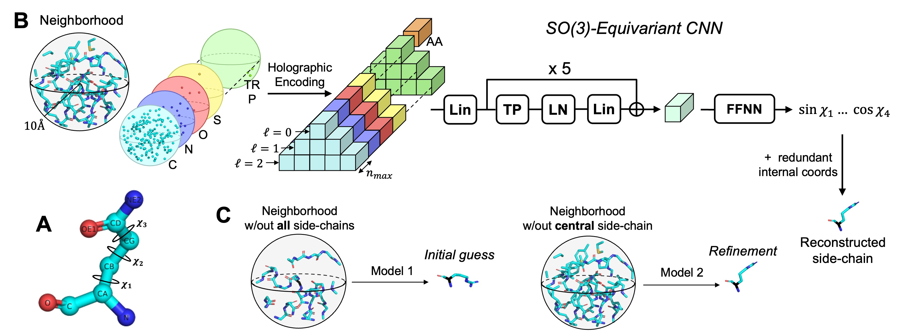

# H-Packer: Holographic Rotationally Equivariant Convolutional Neural Network for Protein Side-Chain Packing

This repo contains code for [H-Packer](https://arxiv.org/abs/2311.09312), a method for side-chain packing based upon rotationally equivariant convolutional neural networks.



## Currently supported features

- Packing side-chain conformations of a full structure, providing a backbone structure and desired sequence information
- Refining side-chain conformations of a full structure
- Add and pack side-chains in *parts* of a structure (keeping some of the structure constant)
- Apply mutations and selectively pack the surrounding side-chains

## Coming soon

- Training new HPacker models


## Installation

Create the `hpacker` conda environment by running the following

```bash
conda env create -f env.yml
```

to install the necessary dependencies.

Then run

```bash
pip install .
```

to install the code in this repo as a package.

If you're going to make edits to the code, run

```bash
pip install -e .
```

so you can test your changes.


## Usage

As simple as a few lines of code:

```python
from hpacker import HPacker
# Initialize HPacker object by passing it a tutple of paths to the pre-trained models, and the backbone-only structure that you want to add side-chains to
hpacker = HPacker(['pretrained_models/initial_guess','pretrained_models/refinement','pretrained_models/initial_guess_conditioned'], 'T0950_bb_only.pdb')
hpacker.reconstruct_sidechains(num_refinement_iterations=5)
hpacker.write_pdb('reconstructed_from_bb_only_T0950.pdb')
```

See the provided [hpacker.ipynb notebook](hpacker.ipynb) for more examples, as well as explanations of the inner workings of H-Packer.

## Training HPacker

*Coming soon*


## Limitations

- Cannot process hetero residues, since they do not play nice with BioPython's ```internal_coords``` module.

## Citation

If you used H-Packer or learned something from it, please cite us:

```

@InProceedings{pmlr-v240-visani24a,
  title = 	 {H-Packer: Holographic Rotationally Equivariant Convolutional Neural Network for Protein Side-Chain Packing},
  author =       {Visani, Gian Marco and Galvin, William and Pun, Michael and Nourmohammad, Armita},
  booktitle = 	 {Proceedings of the 18th Machine Learning in Computational Biology meeting},
  pages = 	 {230--249},
  year = 	 {2024},
  editor = 	 {Knowles, David A. and Mostafavi, Sara},
  volume = 	 {240},
  series = 	 {Proceedings of Machine Learning Research},
  month = 	 {30 Nov--01 Dec},
  publisher =    {PMLR},
  pdf = 	 {https://proceedings.mlr.press/v240/visani24a/visani24a.pdf},
  url = 	 {https://proceedings.mlr.press/v240/visani24a.html},
  abstract = 	 {Accurately modeling protein 3D structure is essential for the design of functional proteins. An important sub-task of structure modeling is protein side-chain packing: predicting the conformation of side-chains (rotamers) given the protein’s backbone structure and amino-acid sequence. Conventional approaches for this task rely on expensive sampling procedures over hand-crafted energy functions and rotamer libraries. Recently, several deep learning methods have been developed to tackle the problem in a data-driven way, albeit with vastly different formulations (from image-to-image translation to directly predicting atomic coordinates). Here, we frame the problem as a joint regression over the side-chains’ true degrees of freedom: the dihedral $\chi$ angles. We carefully study possible objective functions for this task, while accounting for the underlying symmetries of the task. We propose Holographic Packer (H-Packer), a novel two-stage algorithm for side-chain packing built on top of two light-weight rotationally equivariant neural networks. We evaluate our method on CASP13 and CASP14 targets. H-Packer is computationally efficient and shows favorable performance against conventional physics-based algorithms and is competitive against alternative deep learning solutions.}
}

```

